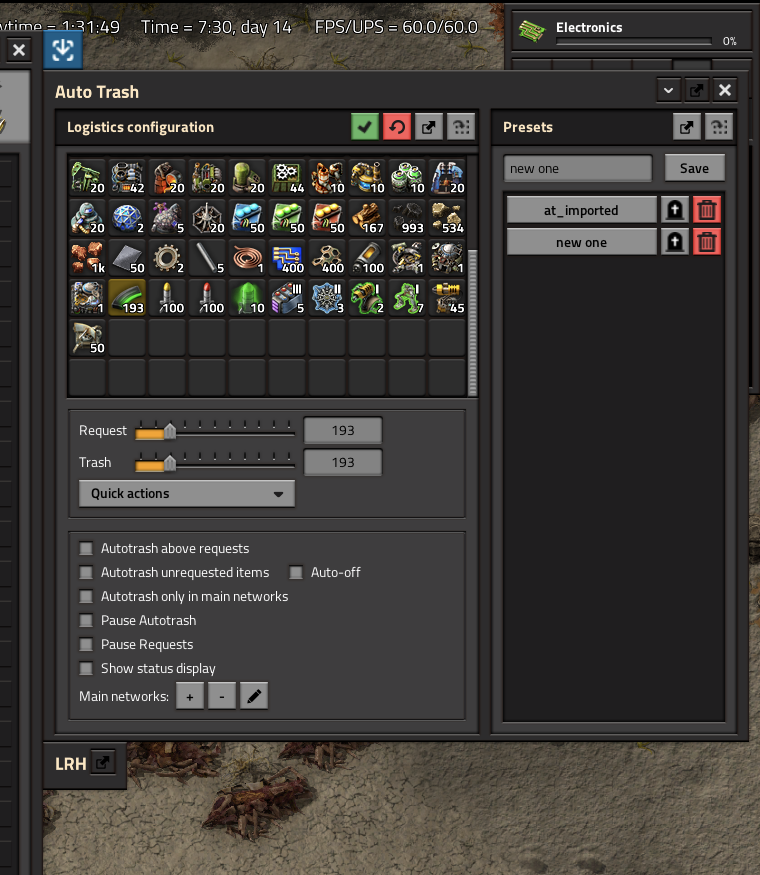
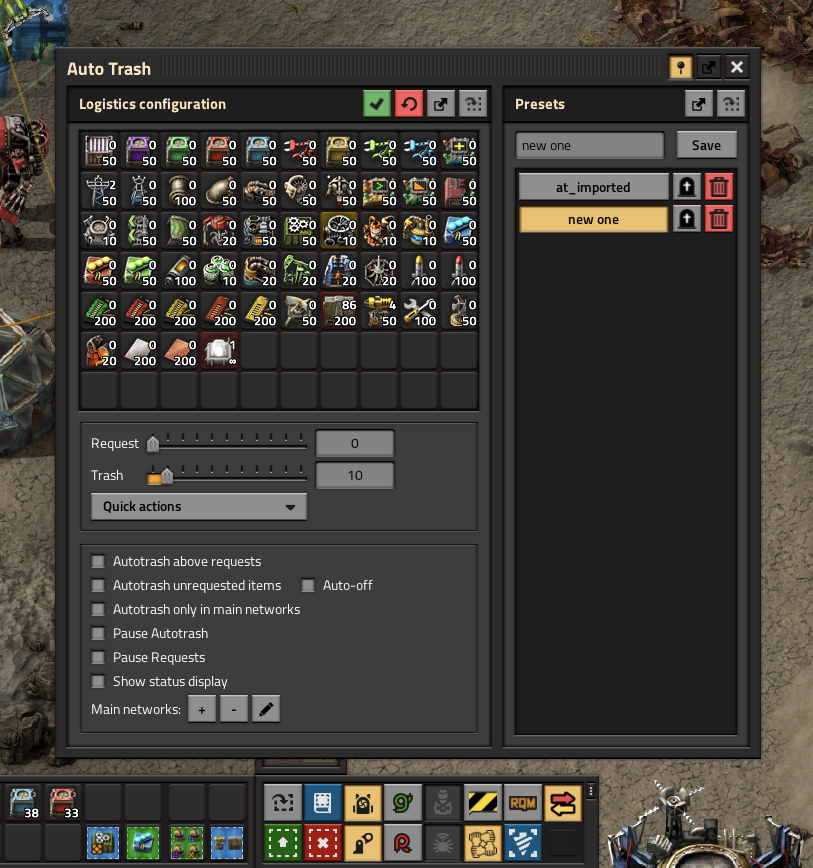
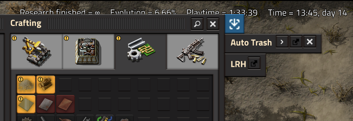

# Auto Trash Reborn

Companion dialog for personal logistics on Factorio **2.0** and **2.1**.

Vanilla already has logistic sections and groups. AutoTrash does **not** replace them — it adds the missing workflow: named presets, blueprint import/export, import from inventory/logistics, network-gated trash, spidertron presets, and request status.

On **Apply**, only a dedicated logistic section named `AutoTrash` is rewritten. Your other vanilla sections stay intact. **Import from logistics** merges filters from all manual sections into the AutoTrash GUI.

## Gallery

*Docked beside the character inventory — configure requests, trash amounts, and presets.*

*Floating window — same companion GUI, with the toolbar shortcut visible in the shortcut bar.*

*Collapsed while docked — expand when you need the full logistics panel.*

## Features

- Configure request and trash settings in one window
- Save and load multiple presets (including after respawn)
- Export/import configuration and presets (string or blueprint/book)
- Request status: grey (fulfilled), yellow (in transit), red (missing)
- Pause requests when dying; load presets after respawning
- Trash unrequested items (uses the native logistic-point flag)
- Pause autotrash when outside certain networks
- Pause requests / auto-trash individually
- Spidertron: load/save presets from a relative GUI panel
- Shift-click configured items to reorder them

## Notes

- Apply writes only the `AutoTrash` section. Edit other groups in the vanilla logistics tab.
- Keep export strings as blueprints in the library when possible.

## Bugs

This is an early revival of a large legacy codebase for Factorio 2.0/2.1. Expect bugs.

Please report issues (with Factorio version, mod version, and steps to reproduce when you can) on GitHub:

https://github.com/ashlessscythe/AutoTrash-Reborn/issues

## Hotkeys

- **Shift + P** — Pause autotrash
- **Shift + O** — Pause logistic requests
- **Shift + T** — Add cursor item to temporary trash (or toggle pause if empty)
- **Control + L** — Toggle AutoTrash GUI
- **Unbound** — Toggle trashing of unrequested items

## Commands

- `/at_import` — Import vanilla logistics (all sections) into the mod GUI
- `/at_reset` — Reset GUI
- `/at_compress` — Remove empty rows in the configuration GUI
- `/at_insert_row <n>` — Insert an empty row after row `n` (rows are 10 slots)

## License

MIT — see [LICENSE](LICENSE). Original AutoTrash by Choumiko.

## Portal uploads (2.0 vs 2.1)

One codebase targets both. For Mod Portal, set `"factorio_version"` to `"2.0"` or `"2.1"` and bump the mod version for each upload (same pattern as SpidertronHunter).

## Release

Tag `vX.Y.Z` matching `info.json` to build the Mod Portal ZIP via GitHub Actions. See [docs/releasing.md](docs/releasing.md). Mod Portal description copy: [docs/mod-portal.md](docs/mod-portal.md).
